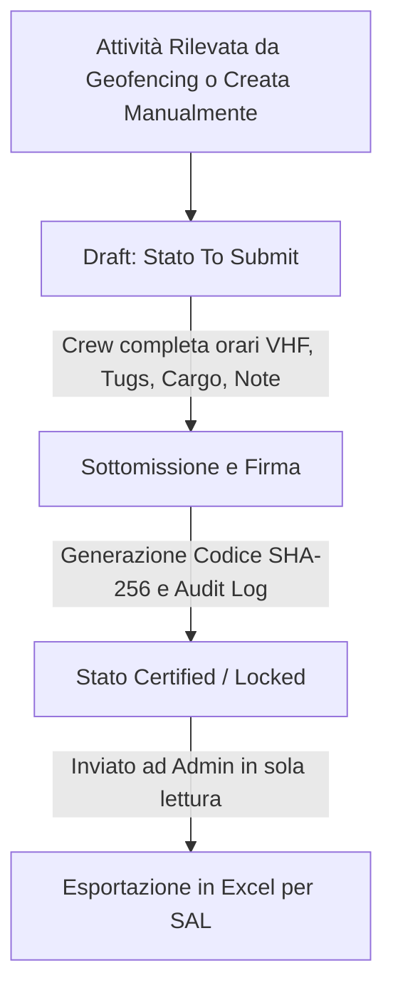

# 📓 KNOWLEDGE ITEM: Gestione Tenant e Flussi Profili (GeoKanban v3.18)

Questo documento traccia l'architettura dei profili utente, la logica multi-tenant di isolamento dei dati e i flussi operativi tra gli equipaggi di bordo (Crew/Crew Admin) e la centrale operativa (Operations/Operations Admin).

---

## 👥 1. Matrice dei Ruoli e dei Permessi

GeoKanban v3.18 implementa 4 ruoli centralizzati definiti nel modulo [permissions.js](file:///c:/Users/giuse/Desktop/ANTIGRAVITY/HANDOVER_GEOKANBAN/src/lib/permissions.js):

| Ruolo | Ambito Mappa (Live Fleet) | Ambito Logbook / Attività (Vessel Activity) | Poteri di Scrittura / Modifica |
| :--- | :--- | :--- | :--- |
| **`crew`** (Equipaggio Singolo) | Vede solo la propria flotta aziendale (o la propria nave). | Vede e modifica **solo** le attività della propria nave. | Può completare le attività e sottomettere il Logbook. |
| **`crew_admin`** (Compagnia Armatoriale) | **Vede l'intera flotta globale** sulla mappa. | Vede e completa **solo** le attività delle navi della propria compagnia. | Può compilare e sottomettere il Logbook. |
| **`operation`** (Operatore Centrale) | Vede l'intera flotta globale. | Vede le attività di **tutte** le navi. | Sola lettura delle attività certificate. Supporto chat. |
| **`operation_admin`** (Super Admin) | Vede l'intera flotta globale. | Vede le attività di **tutte** le navi. Esporta i dati. | Accesso a DB Manager e User Management. Sola lettura delle attività certificate. |

---

## 🏛️ 2. Isolamento Multi-Tenant (Database & Frontend)

Il sistema isola i dati delle compagnie armatoriali a livello logico:

1.  **Profilo Utente (`user_profiles`):**
    *   `company_id`: Associa l'utente a una specifica compagnia armatoriale.
    *   `vessel_id` / `mmsi`: Identifica la nave specifica assegnata (solo per ruolo `crew`).
2.  **Nave (`vessels`):**
    *   `company_id`: Associa ciascuna nave a una specifica compagnia.
3.  **Attività e Tracciamento:**
    *   Le posizioni GPS storiche e in tempo reale (`vesselPositions`) vengono filtrate nel `DataContext` in base alla compagnia dell'utente per gli utenti `crew` limitati.
    *   Le attività (`vessel_activity`) vengono visualizzate e completate in base al ruolo:
        *   `crew` $\rightarrow$ filtra strettamente per singola nave (`vessel_id`).
        *   `crew_admin` $\rightarrow$ filtra per l'array di navi associate alla compagnia (`companyVesselIds`).
        *   `operation` / `operation_admin` $\rightarrow$ nessuna restrizione, vedono l'intero ecosistema.

---

## 🔒 3. Ciclo di Vita del Logbook e Blindatura dei Dati

Il flusso di compilazione e certificazione segue una logica di sicurezza crittografica e conformità operativa (SAL - Stato Avanzamento Lavori):

1.  **Stato Draft (`TO SUBMIT`):** L'attività è modificabile da Crew. Il sistema esegue un salvataggio automatico (auto-save) locale ogni 3 secondi.
2.  **Certificazione & Blocco (`CERTIFIED`):** All'atto dell'invio, viene calcolato un hash crittografico SHA-256 univoco che sigilla la riga del logbook. La riga diventa **completamente locked** (sola lettura per tutti, inclusi gli Admin).
3.  **SAL & Export:** Gli amministratori centrali possono visionare il registro delle attività sottomesse, ma **non possono modificarle**, garantendo l'assoluta integrità dei dati contro manipolazioni esterne. Possono esclusivamente esportarle in Excel per la rendicontazione dei lavori.

---

## 🚨 4. Riformulazione Logica e Nuovi Flussi v3.18.1

Per sopperire alle limitazioni della telemetria AIS (blackout di segnale e zone d'ombra terrestri), vengono introdotti due miglioramenti chiave:

### A. Rilevamento dei Gap di Telemetria (Blackout Alert)
*   **Logica:** Se una nave attiva non trasmette dati GPS per un periodo superiore a **24 ore**, viene registrato un gap operativo.
*   **Alert UI:** Viene mostrato un banner di attenzione persistente sia per il Crew aziendale sia per l'Admin:
    > ⚠️ *Attenzione: Sider Orion non invia segnali AIS da 42 ore. Potrebbe essere necessario registrare manualmente un'attività.*

### B. Pulsante "Aggiungi Attività Manuale" (Manual Entry)
*   **Logica:** Consente all'equipaggio o alla compagnia (Crew/Crew Admin) di forzare la creazione di un'attività (es. Loading a Piombino) selezionando porto, date di arrivo/partenza e nave della propria flotta.
*   **Metadato `source`:** L'attività creata manualmente viene salvata con `source = 'manual'`.
*   **Tracciabilità:** Tutte le attività manuali mostrano un badge/alert visivo arancione `⚠️ MANUAL ENTRY` per indicare che non sono state generate autonomamente dal sistema, richiamando l'attenzione durante la fase di audit e validazione del SAL.
